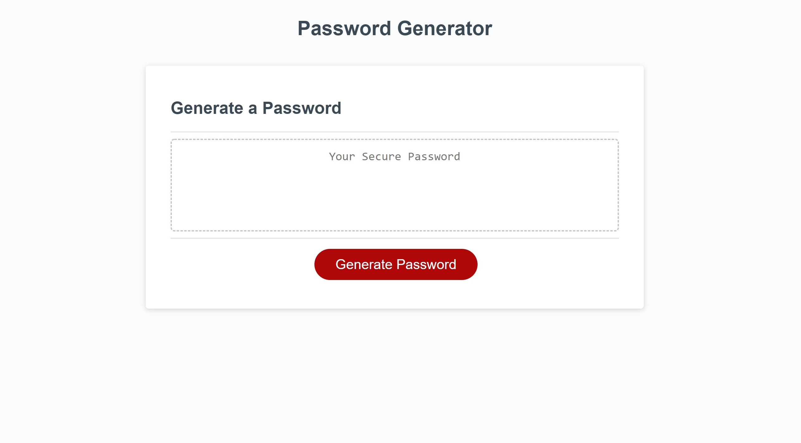
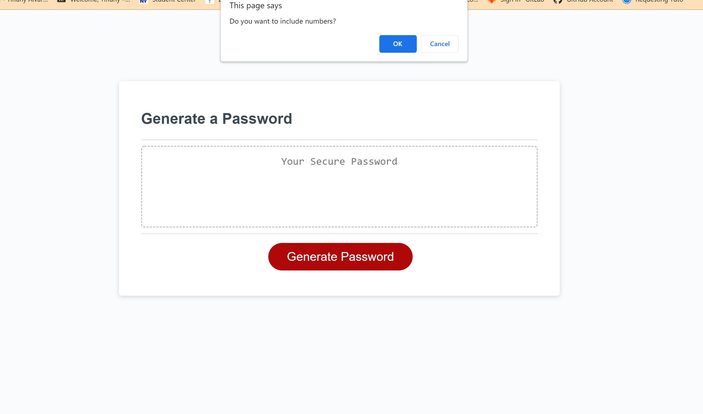

# Password Generator 

### Deployed Link: https://tiffyalva.github.io/password-generator/
## Module 3 challenge
- Password generator starter code was given.
- I created user prompts with JavaScript.
- I included length, lowercase, uppercase, numbers, and special characters.
 

### Length prompt

### Lowercase prompt

### Uppercase prompt

### Number prompt

### Special characters prompt

